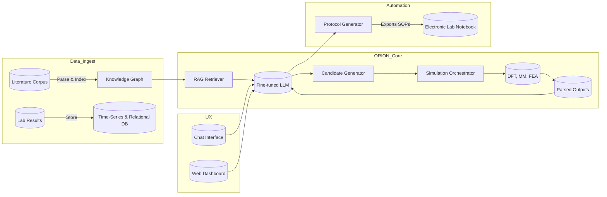

# ORION: Optimized Research & Innovation for Organized Nanomaterials

<p align="center">
  
</p>

<p align="center">
  <strong>Charting new frontiers in material science</strong>
</p>

<p align="center">
  <a href="#features">Features</a> •
  <a href="#installation">Installation</a> •
  <a href="#quick-start">Quick Start</a> •
  <a href="#documentation">Documentation</a> •
  <a href="#contributing">Contributing</a>
</p>

---

## Overview

ORION is an autonomous AI agent platform that revolutionizes materials science research by integrating cutting-edge literature mining, intelligent candidate generation, automated simulations, and experimental design. It creates a closed-loop system from theoretical concepts to practical laboratory protocols.

### Key Capabilities

- 📚 **Literature Mining & Knowledge Graph**: Automatically ingests and processes scientific literature, patents, and experimental data
- 🧬 **Intelligent Material Generation**: Uses LLMs to propose novel material candidates based on desired properties
- 🔬 **Simulation Orchestration**: Interfaces with DFT, molecular mechanics, and FEA tools for in-silico validation
- 🧪 **Automated Experimental Design**: Generates detailed laboratory protocols and safety procedures
- 🔄 **Active Learning Loop**: Continuously improves predictions based on experimental feedback
- 💬 **Natural Language Interface**: Interact with the system using conversational queries

## Architecture



## Features

### 🧠 Knowledge Graph
- Neo4j-based materials ontology
- Automated relationship extraction
- Property-structure-process mapping
- Real-time graph analytics

### 🤖 RAG System
- Hybrid sparse-dense retrieval
- Cross-encoder reranking
- Context-aware generation
- Citation tracking

### 🔮 Candidate Generation
- Formula prediction
- Structure optimization
- Property targeting
- Novelty scoring

### ⚡ Simulation Integration
- VASP/Quantum ESPRESSO support
- LAMMPS molecular dynamics
- Queue management
- Result parsing

### 📋 Protocol Generation
- Step-by-step procedures
- Safety recommendations
- Equipment specifications
- Jinja2 templates

## Installation

### Prerequisites

- Python 3.9+
- Neo4j 4.4+
- Redis 6.0+
- PostgreSQL 13+
- Docker (optional)

### Quick Install

```bash
# Clone the repository
git clone https://github.com/your-org/orion-platform.git
cd orion-platform

# Install with Poetry
poetry install

# Or with pip
pip install -e .

# Set up environment variables
cp .env.example .env
# Edit .env with your configuration

# Initialize databases
python scripts/init_db.py

# Start services
docker-compose up -d
```

### Configuration

Edit `config/config.yaml` to customize:

```yaml
app:
  name: "ORION"
  environment: "development"

database:
  neo4j:
    uri: "bolt://localhost:7687"
    user: "neo4j"
    password: "your-password"

llm:
  provider: "openai"
  model: "gpt-4-turbo-preview"
  
rag:
  embedding:
    model: "sentence-transformers/all-mpnet-base-v2"
```

## Quick Start

### Python API

```python
import asyncio
from orion import ORIONSystem

async def main():
    # Initialize ORION
    orion = ORIONSystem()
    await orion.initialize()
    
    # Generate a new material
    response = await orion.process_query(
        "Design a self-healing polymer with Tg > 80°C"
    )
    
    # View candidates
    for candidate in response["result"]["candidates"]:
        print(f"Material: {candidate['formula']}")
        print(f"Score: {candidate['score']}")
    
    await orion.shutdown()

asyncio.run(main())
```

### Command Line

```bash
# Start the chat interface
orion chat

# Process a query
orion query "Find materials with bandgap between 1.5 and 2.0 eV"

# Ingest data
orion ingest --source materials_project.json --type materials_project

# Generate protocol
orion protocol --material "TiO2" --method "sol_gel"
```

### Web Interface

```bash
# Start the web server
orion serve

# Access at http://localhost:8000
```

## API Examples

### Material Search

```python
# Search by properties
materials = await orion.knowledge_graph.find_materials_by_property(
    property_name="band_gap",
    min_value=1.5,
    max_value=2.0,
    unit="eV"
)

# Find similar materials
similar = await orion.knowledge_graph.find_similar_materials(
    material_id="mp-1234",
    limit=10
)
```

### Simulation Submission

```python
# Submit DFT calculation
job_id = await orion.simulation_orchestrator.submit_job(
    material={"formula": "TiO2", "structure": structure_data},
    simulation_type="dft",
    parameters={
        "functional": "PBE",
        "cutoff": 520,
        "k_points": [4, 4, 4]
    }
)

# Check status
status = await orion.simulation_orchestrator.get_job_status(job_id)
```

### Protocol Generation

```python
# Generate synthesis protocol
protocol = await orion.experimental_designer.design_protocol(
    material="HfO2",
    method="ald",
    constraints={
        "temperature_max": 300,  # °C
        "substrate": "Si"
    }
)

# Export as PDF
await protocol.export("HfO2_ALD_protocol.pdf")
```

## Documentation

Comprehensive documentation is available at [docs/](docs/):

- [User Guide](docs/user_guide.md)
- [API Reference](docs/api_reference.md)
- [Knowledge Graph Schema](docs/kg_schema.md)
- [Simulation Engines](docs/simulations.md)
- [Protocol Templates](docs/protocols.md)

## Performance

ORION includes built-in performance monitoring:

```python
# Get system metrics
metrics = await orion.get_system_status()
print(f"CPU Usage: {metrics['performance']['cpu_usage']['mean']:.1f}%")
print(f"Memory: {metrics['performance']['memory_usage']['mean']:.1f}%")

# Check bottlenecks
bottlenecks = orion.bottleneck_analyzer.get_bottleneck_report()
for issue in bottlenecks['bottlenecks']:
    print(f"{issue['severity']}: {issue['component']} - {issue['recommendation']}")
```

## Contributing

We welcome contributions! Please see [CONTRIBUTING.md](CONTRIBUTING.md) for guidelines.

### Development Setup

```bash
# Install development dependencies
poetry install --with dev

# Run tests
pytest

# Run linting
black src/
flake8 src/
mypy src/

# Build documentation
cd docs && make html
```

## License

This project is licensed under the MIT License - see [LICENSE](LICENSE) for details.

## Citation

If you use ORION in your research, please cite:

```bibtex
@software{orion2024,
  title = {ORION: Optimized Research & Innovation for Organized Nanomaterials},
  author = {ORION Development Team},
  year = {2024},
  url = {https://github.com/your-org/orion-platform}
}
```

## Support

- 📧 Email: support@orion-materials.ai
- 💬 Discord: [Join our community](https://discord.gg/orion)
- 🐛 Issues: [GitHub Issues](https://github.com/your-org/orion-platform/issues)

---

<p align="center">
  Made with ❤️ by the ORION Team
</p>