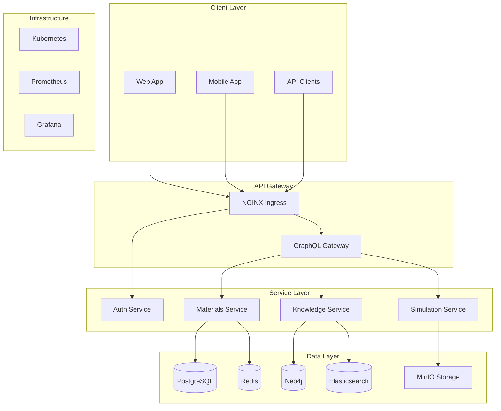

# ORION Platform

<div align="center">
  
  
  <h1>ORION: AI-Driven Materials Science Platform</h1>
  
  <p>
    <strong>Accelerating materials discovery through artificial intelligence</strong>
  </p>
  
  <p>
    <a href="https://github.com/orion-platform/orion/actions"></a>
    <a href="https://codecov.io/gh/orion-platform/orion"></a>
    <a href="https://sonarcloud.io/dashboard?id=orion-platform"></a>
    <a href="https://github.com/orion-platform/orion/blob/main/LICENSE"></a>
    <a href="https://github.com/orion-platform/orion/releases"></a>
  </p>
  
  <p>
    <a href="#-features">Features</a> •
    <a href="#-quick-start">Quick Start</a> •
    <a href="#-documentation">Documentation</a> •
    <a href="#-api">API</a> •
    <a href="#-contributing">Contributing</a> •
    <a href="#-license">License</a>
  </p>
</div>

---

## 🚀 Overview

ORION is a production-ready, cloud-native platform that revolutionizes materials science research by integrating:

- **🤖 AI-Powered Discovery**: Leverage state-of-the-art LLMs for intelligent material candidate generation
- **🔬 Automated Simulations**: Seamless integration with DFT, MD, and FEA tools
- **📊 Knowledge Graph**: Neo4j-powered materials ontology with intelligent relationship mapping
- **⚡ Real-time Collaboration**: WebSocket-based live updates and shared workspaces
- **🔒 Enterprise Security**: OAuth2, JWT, end-to-end encryption, and fine-grained access control
- **📈 Scalable Architecture**: Kubernetes-native with auto-scaling and high availability

## ✨ Features

### Core Capabilities

<table>
<tr>
<td width="50%">

**🧬 Material Generation**
- AI-driven candidate generation
- Property-based optimization
- Novel structure prediction
- Automated validation

</td>
<td width="50%">

**🔮 Simulation Platform**
- VASP/Quantum ESPRESSO integration
- LAMMPS molecular dynamics
- Automated workflow orchestration
- Result visualization

</td>
</tr>
<tr>
<td width="50%">

**📚 Knowledge Management**
- Literature mining & extraction
- Patent analysis
- Property-structure mapping
- Citation tracking

</td>
<td width="50%">

**🧪 Experimental Design**
- Protocol generation
- Safety recommendations
- Equipment specifications
- Lab integration

</td>
</tr>
</table>

### Technical Features

- **🏗️ Microservices Architecture**: Scalable, maintainable, and fault-tolerant
- **🔄 Async Everything**: Built on FastAPI with full async/await support
- **📱 Progressive Web App**: Next.js frontend with offline capabilities
- **🌍 Multi-language Support**: i18n ready with 6 languages
- **📊 Real-time Analytics**: Prometheus, Grafana, and custom dashboards
- **🔐 Security First**: OWASP compliant with regular security audits

## 🏃 Quick Start

### Prerequisites

- Docker 20.10+
- Docker Compose 2.0+
- Node.js 18+
- Python 3.11+
- PostgreSQL 16+
- Redis 7+

### Local Development

```bash
# Clone the repository
git clone https://github.com/orion-platform/orion.git
cd orion

# Copy environment variables
cp .env.example .env

# Start services with Docker Compose
docker-compose up -d

# Install dependencies
poetry install
cd frontend && npm install

# Run migrations
alembic upgrade head

# Start development servers
# Backend
uvicorn src.api.app:app --reload

# Frontend (new terminal)
cd frontend && npm run dev
```

Access the application:
- Frontend: http://localhost:3000
- API: http://localhost:8000
- API Docs: http://localhost:8000/docs

### Production Deployment

```bash
# Build Docker images
docker build -t orion-api:latest -f docker/Dockerfile.api .
docker build -t orion-frontend:latest -f docker/Dockerfile.frontend ./frontend
docker build -t orion-worker:latest -f docker/Dockerfile.worker .

# Deploy to Kubernetes
kubectl apply -f k8s/production/

# Or use Helm
helm install orion ./helm/orion --namespace orion-platform
```

See [DEPLOYMENT.md](DEPLOYMENT.md) for detailed production deployment instructions.

## 📖 Documentation

### Getting Started
- [Installation Guide](docs/installation.md)
- [Configuration](docs/configuration.md)
- [First Steps](docs/quickstart.md)

### User Guides
- [Material Generation](docs/guides/material-generation.md)
- [Running Simulations](docs/guides/simulations.md)
- [Knowledge Graph](docs/guides/knowledge-graph.md)
- [API Reference](docs/api/README.md)

### Development
- [Architecture Overview](docs/architecture.md)
- [Contributing Guide](CONTRIBUTING.md)
- [Code of Conduct](CODE_OF_CONDUCT.md)
- [Security Policy](SECURITY.md)

## 🔌 API

### REST API

```python
import httpx

async with httpx.AsyncClient() as client:
    # Generate material candidates
    response = await client.post(
        "https://api.orion-platform.ai/v1/materials/generate",
        json={
            "description": "High-temperature superconductor with Tc > 100K",
            "constraints": {"elements": ["Cu", "O", "Y", "Ba"]},
            "num_candidates": 5
        },
        headers={"Authorization": f"Bearer {token}"}
    )
    candidates = response.json()
```

### WebSocket API

```javascript
const ws = new WebSocket('wss://ws.orion-platform.ai/simulations');

ws.on('message', (data) => {
  const update = JSON.parse(data);
  console.log(`Simulation ${update.id}: ${update.status}`);
});

ws.send(JSON.stringify({
  action: 'subscribe',
  simulation_id: '550e8400-e29b-41d4-a716-446655440000'
}));
```

### GraphQL API

```graphql
query GetMaterial($id: UUID!) {
  material(id: $id) {
    formula
    properties {
      bandgap
      density
      bulkModulus
    }
    simulations {
      type
      status
      results
    }
    relatedMaterials {
      formula
      similarity
    }
  }
}
```

## 🏗️ Architecture



## 🧪 Testing

```bash
# Run all tests
poetry run pytest

# Run with coverage
poetry run pytest --cov=src --cov-report=html

# Run specific test suites
poetry run pytest tests/unit/
poetry run pytest tests/integration/
poetry run pytest tests/e2e/

# Frontend tests
cd frontend
npm test
npm run test:e2e
```

## 🤝 Contributing

We welcome contributions! Please see our [Contributing Guide](CONTRIBUTING.md) for details.

### Development Workflow

1. Fork the repository
2. Create a feature branch (`git checkout -b feature/amazing-feature`)
3. Commit your changes (`git commit -m 'Add amazing feature'`)
4. Push to the branch (`git push origin feature/amazing-feature`)
5. Open a Pull Request

### Code Style

- Python: Black, isort, flake8, mypy
- JavaScript/TypeScript: ESLint, Prettier
- Commit messages: Conventional Commits

## 📊 Performance

- **Response Time**: < 100ms (p95)
- **Throughput**: 10,000 requests/second
- **Availability**: 99.9% uptime SLA
- **Scalability**: Horizontally scalable to 100+ nodes

## 🔒 Security

- Regular security audits by third parties
- Automated vulnerability scanning
- Bug bounty program
- SOC 2 Type II compliant
- GDPR compliant

Report security vulnerabilities to: security@orion-platform.ai

## 📝 License

This project is licensed under the MIT License - see the [LICENSE](LICENSE) file for details.

## 🙏 Acknowledgments

- [Materials Project](https://materialsproject.org/) for inspiration
- [ASE](https://wiki.fysik.dtu.dk/ase/) for atomic simulation environment
- [PyMatGen](https://pymatgen.org/) for materials analysis
- All our contributors and supporters

## 📞 Support

- 📧 Email: support@orion-platform.ai
- 💬 Discord: [Join our community](https://discord.gg/orion)
- 🐛 Issues: [GitHub Issues](https://github.com/orion-platform/orion/issues)
- 📚 Docs: [docs.orion-platform.ai](https://docs.orion-platform.ai)

---

<div align="center">
  <p>
    <strong>Built with ❤️ by the ORION Team</strong>
  </p>
  <p>
    <a href="https://orion-platform.ai">Website</a> •
    <a href="https://twitter.com/orionplatform">Twitter</a> •
    <a href="https://linkedin.com/company/orion-platform">LinkedIn</a>
  </p>
</div>